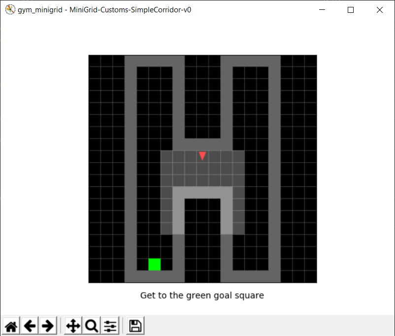
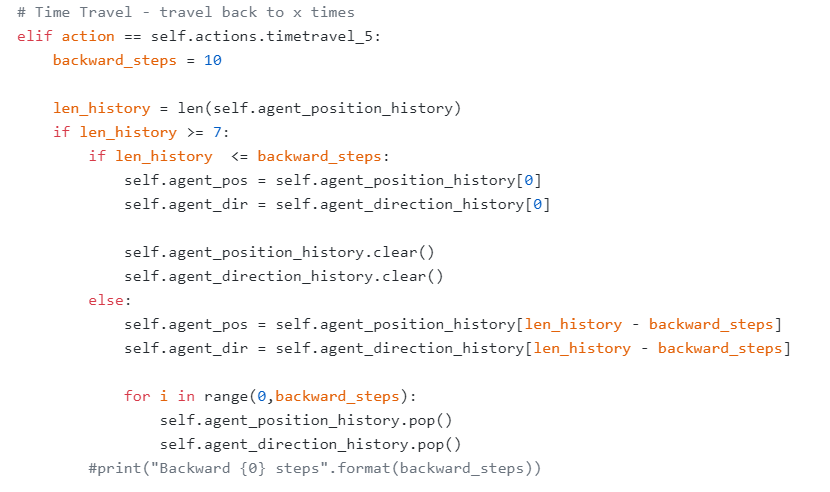

# Time-Travel
## Introduction
In this project, we are creating a custom environment. The environment is trivial and provides an agent with defined rules and design of a “game”. Here we have starting and ending points. The aim of the AI is to get to the end and with the help of Reinforcement Learning, possibly go several decisions back and improve its performance. What we eventually want to imitate is how the human thinks when making decisions from the experiences based on the reward signal. As might be expected, our model will be designed with the help of a rewarding system, which means there will be a reward score for the agent with every decision it makes. This will be a measure of how much the AI is motivated to make a similar decision. All of the methods and models will be described in the following sections.

## Method
* Reinforcement learning
* PPO
* LSTM
* Actor-critic

## Enviroment
The enviroment is based on the following github. We are using gym-minigrid for the project.
https://github.com/utnnproject/gym-minigrid

## Custom enviroment
We made our own custom enviroment for using time-travel. In the customs.py file, we defined our simple enviroment for the project.

<p align="center">

</p>

## Time-Travel
We used a method called time-travel to make the agent learn more efficient. By using time-travel, agent now has a option to go back few frames before from the current frame and change decisions to reach the end point more efficiently. We defined the function of time-travel on the minigrid.py file.

<p align="center">

</p>

The past frames are memorized in a list and this list is updated every frame. When the length of this list is more than 7, the agent can take an option to go back frames.

## Result of Time-Travel
This is the exploration without using time-travel. You can see that the agent is exploring across the map to find the end point.


Now this is exploration using time-travel. The agent is going back on time so it can reach to end point with less exploration.


## Training
To train the agents you can code below.

```
python -m scripts.train --algo ppo --env MiniGrid-Customs-LineCorridor-v0 --model <model_name> --recurrence 4 --save-interval 10 --frames 5000000 --lr 0.0003 --discount 0.95
```

## References
<a id="1">[1]</a> 
https://github.com/DLR-RM/stable-baselines3

<a id="2">[2]</a> 
https://github.com/DLR-RM/rl-baselines3-zoo

<a id="3">[3]</a> 
https://github.com/lcswillems/rl-starter-files

<a id="4">[4]</a> 
https://github.com/lcswillems/torch-ac
